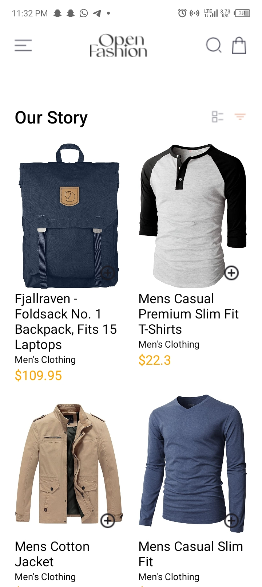
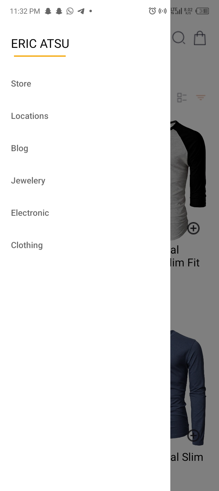
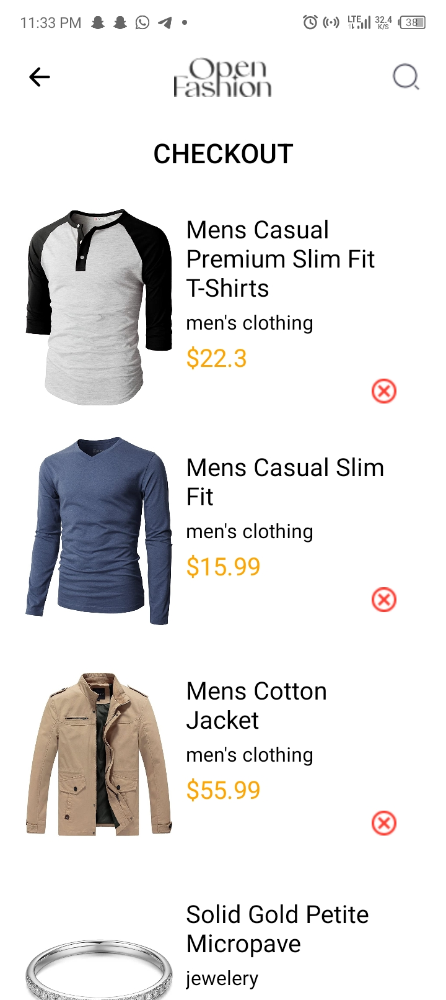

## Design Choices for the app
### Cart Management: 
I used async storage for the cart whenever the plus icon is pressed on a product on the home page the product is added to an async storage which can be accessed on the cart screen and hence display cart content and the same applies for product removal from cart whenever the cross icon is pressed on the cart page that item is removed from the async storage.

## Header Content:
The header of all the screens in the app is just a single component that accepts a screen prop and hence depending on the current screen the header will show the information that is supposed to be in the header component for that screen.

## Products:
The products in the app are all fetched from the fake store api and stored in a useState hook which is then accessed with the help of a map function hence diplaying the fetched products

## ProductDetails screen:
The product details screen accepts an id parameter which is then accessed using route.params and then the id is used to get the product details from the api.

