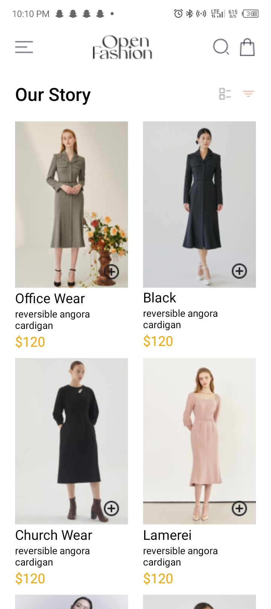
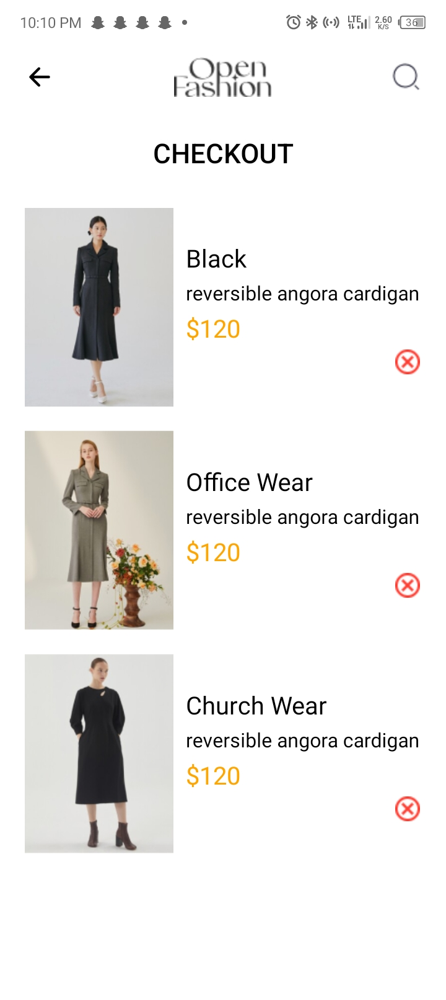

## Design Choices for the app
### Cart Management: 
I used async storage for the cart whenever the plus icon is pressed on a product on the home page the product is added to an async storage which can be accessed on the cart screen and hence display cart content and the same applies for product removal from cart whenever the cross icon is pressed on the cart page that item is removed from the async storage.

## Header Content:
Since there is a header on both the home screen and cart screen with just slightly different content I used react context and with the help of a useEffect hook stored the data either "home" or "cart" in the context and hence whenever a user navigates to a new screen the data in the context api is updated which in turn determines the content of the header component.

